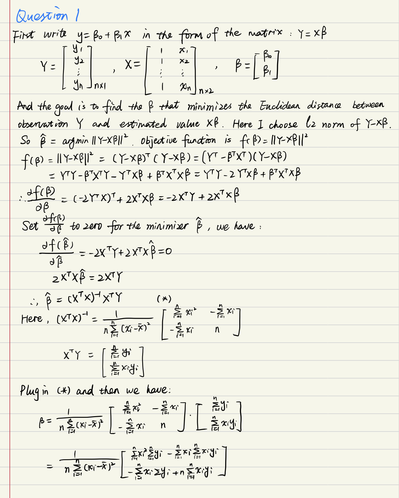
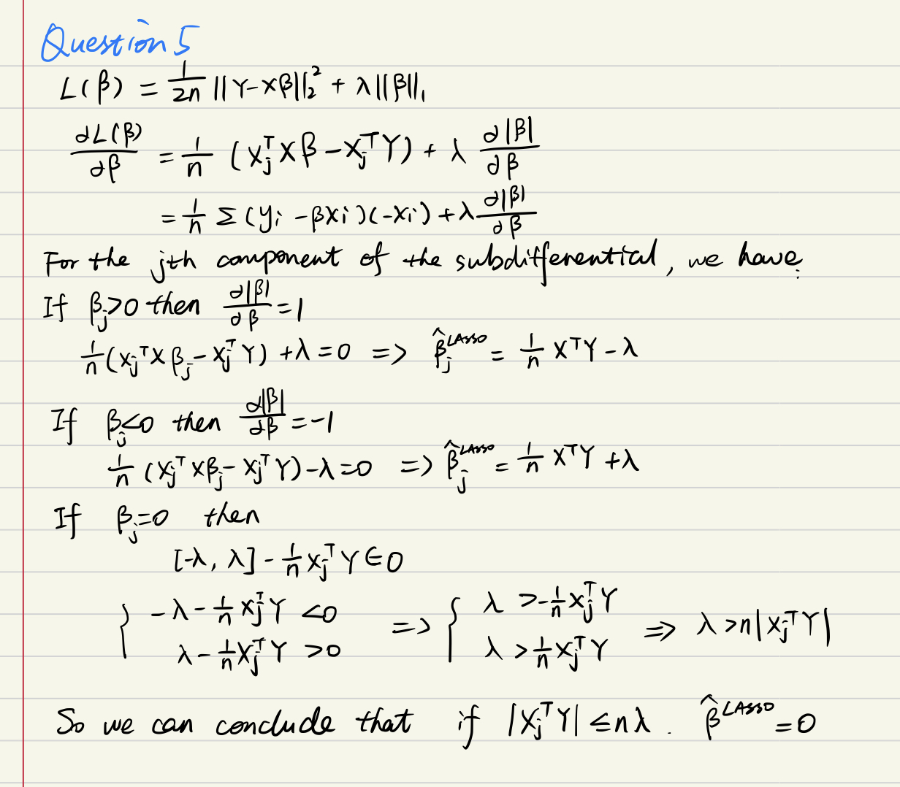

```{r, include = FALSE}
knitr::opts_chunk$set(
  collapse = TRUE,
  comment = "#>"
)
```

```{r setup}
library(bis557)
```

## Question 1
Reference:http://users.stat.umn.edu/~helwig/notes/slr-Notes.pdf
```{r}

```
## Question 2
The function ridge_regression can takes into account colinear regression variables and return a list of components of the fitted ridge regression model, including coefficients and lambda.
```{r}
# an example
library(stats)
data(iris)
form <- Sepal.Length ~. 
X <- model.matrix(form, iris)
y <- iris[[as.character(form)[2]]][as.numeric(rownames(X))]

# fit in ridge_regression funtion
fit_model <- ridge_regression(X, y, lambda = 0)
fit_coef <- fit_model$coefficients
cat("The coefficients of the fitted ridge regression model is:", fit_coef)
```

## Question 3
The method I used for optimizing the ridge parameter is cross validation, and it is complished by a function called opt_lambda.
```{r}
# an example
# First simulate data for ridge regression
set.seed(725)
n <- 200
p <- 4
N <- 500
M <- 20
beta <- c(1, -1, 0.5, 0)
mu <- rep(0, p)

Sigma <- matrix(0.9, nrow = p, ncol = p)
diag(Sigma) <- 1

X <- MASS::mvrnorm(n, mu, Sigma)
y <- X %*% beta + rnorm(n, sd = 5)
data <- as.data.frame(cbind(y, X))
colnames(data) <- c("y","x1","x2","x3","x4")

# implement cross validation to find the best lambda
opt_lambda(X, y, n_folds = 5, lambda_vals = exp(seq(-2, 5, 0.2)))
cat("The coefficients of the fitted ridge regression model is:", fit_coef)
```

## Question 4
Section 2.8 of CASL shows that as the numerical stability decreases, statistical errors increase. Reproduce the results and then show that using ridge regression can increase numerical stability and decrease statistical error.
### Reproduce the result in section 2.8
```{r}
library(casl)
# Data stimulation
set.seed(557)
n <- 1000
p <- 25
beta <- c(1, rep(0, p - 1))
X <- matrix(rnorm(n * p), ncol = p)
# Condition number of Matrix X
svals <- svd(X)$d
con_num_0 <- max(svals) / min(svals)

# generate data y and see the difference between estimators and true beta
N <- 1e4
l2_errors <- rep(0, N)
for (k in 1:N) {
  y <- X %*% beta + rnorm(n)
  betahat <- casl_ols_svd(X, y)
  l2_errors[k] <- sqrt(sum((betahat - beta)^2))
}
error_0 <- mean(l2_errors)

cat("Condition number of Matrix X is:", con_num_0)
cat("The error rate is:", error_0)
```
Now consider two columns of X are correlated and see how the result change.
```{r}
# Use two columns of X that are highly correlated
alpha <- 0.001
X[,1] <- X[,1] * alpha + X[,2] * (1 - alpha)
svals <- svd(X)$d
con_num_1 <- max(svals) / min(svals)

# Simulate again
N <- 1e4
l2_errors <- rep(0, N)
for (k in 1:N) {
  y <- X %*% beta + rnorm(n)
  betahat <- solve(crossprod(X), crossprod(X, y))
  l2_errors[k] <- sqrt(sum((betahat - beta)^2))
}
error_1 <- mean(l2_errors)
cat("The updated condition number of Matrix X is:", con_num_1) 
cat("The new error rate is:", error_1)
```
We can conclude that the condition number of X is indeed an indicator of the statistical error in estimating beta. The numerical stability decreases while statistical errors increase.

### Using ridge regression
```{r}
# First introduce lambda and see how it can affect the condition number of X
lambda <- 0.5
svals <- svd(X)$d
con_num_2 <- (max(svals)+lambda) / (min(svals)+lambda)

# generate data y and see the difference between estimators and true beta
for (k in 1:N) {
  y <- X %*% beta + rnorm(n)
  betahat <- solve(crossprod(X) + lambda, crossprod(X, y))
  l2_errors[k] <- sqrt(sum((betahat - beta)^2))
}
error_2 <- mean(l2_errors)

cat("The condition number of X is:", con_num_2)
cat("The error rate is:", error_2)
```
We can see that the condition number is much smaller.

## Question 5
Reference: http://statsmaths.github.io/stat612/lectures/lec17/lecture17.pdf
```{r}

```


